## 这是什么?

```text
    这是一个python的工具，用于处理 URL。 Hunter,fofa，弄出来的有的不携带协议，有的携带协议
  
  我: 
  	呵呵[反派邪笑], 为什么！为什么！你们这写URL乱七八糟，真是调皮的熊孩子。桀桀桀~
  	嗯？你的协议呢,为什么不携带？嗯？What? 你压根不是URL！居然想混在里面！
    等着，看我的python大法，让你们乖乖的呆在一起。老实给我呆着，哼哼 [傲娇] ，听我口令 ！ URL,报数！
    URL_1: 一~
    URL_2: 二~
    URL_3: 哥~ 哥~
  
  我:
  	欸~，好孩子~。
```

## 如何使用

将需要的URL 例如下方，在左侧选择不同功能， 测试数据:

```text
1.jpg
2.png
.cpp

localhost

htt://www.baidu.com

http://www.google.com
http://www.yahoo.com/
http://www.yahoo.com:8080
http://www.yahoo.com:8080/
http://www.yahoo.com:8080/?index=1
http://www.yahoo.com:8080/?index=0
https://www.google.com
https://www.yahoo.com:8080/
 
https://www.yahoo.com:8080/?index=1
ftp://www.ftp.com
ftp://www.ftp.com:21
ftp://127.0.0.1
ftp://127.0.0.1:21
ftp://127.0.0.1:21?index=1
ftp://127.0.0.1:21/
127.0.0.1
127.0.0.1/query?index=1
127.0.0.1:8080
127.0.0.1:8080/
127.0.0.1:8080/?index=1

www.baidu.com/url
www.baidu.com/query?name=小明
ftp://www.baidu.com/query?name=小明
www.baidu.com:8080
www.baidu.com:8080/url
www.baidu.com:8080/url=我
www.baidu.com
www.baidu.com?index=1
www.我.com
www.我
www.baidu.com:443
www.baidu.com:21
www.1
www.1.
www.1.c
wwww.1.cc
www.1.cc.com
wwww.1.cc
wwww.1.cc.

```

### 功能一、URL 分类

有两种输出模式:

第一种:  将URL 分类到不同的列

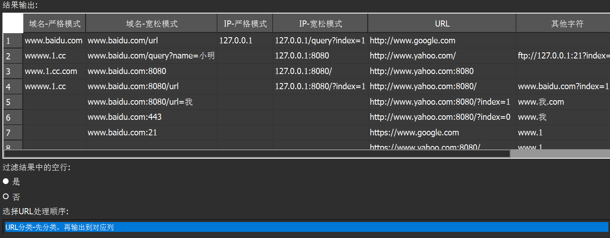

第二种: 将 URL 一行一行的分类

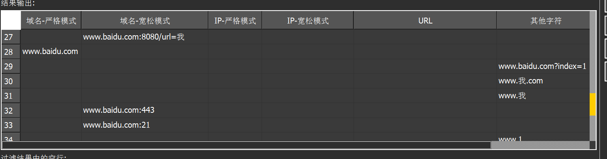

### 功能二、提取URL信息

提取URL中的协议、端口等信息，如果本身没有携带对应信息，则同样是没有的，如果想有可使用添加端口，添加协议功能

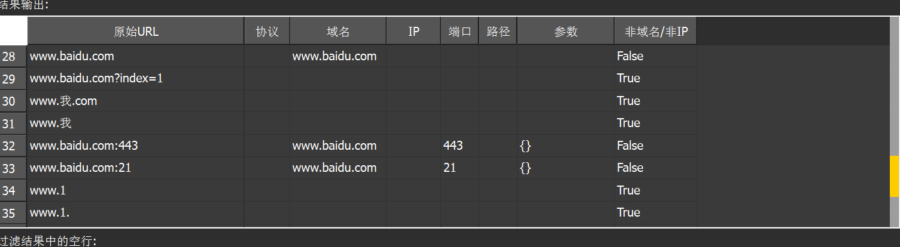

### 功能三、添加端口

给域名、URL、IP 添加端口，如果本身携带，则不添加，URL携带协议，则自动依据协议添加端口

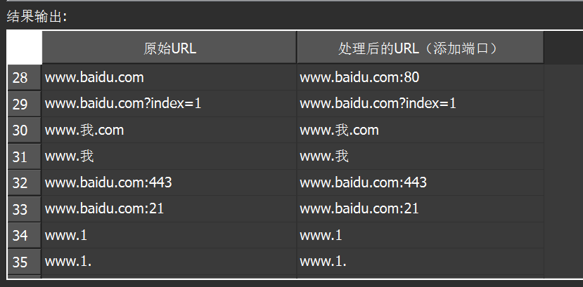

### 功能四、添加协议

同上，依据端口添加协议


### 功能五、去除空行 、空格

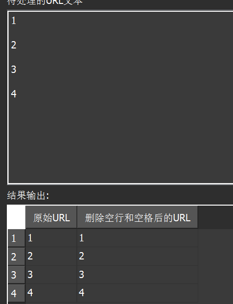

### 功能六、出去两边的引号

有时候复制下来说不定一行URL 左右两边会有 引号存在

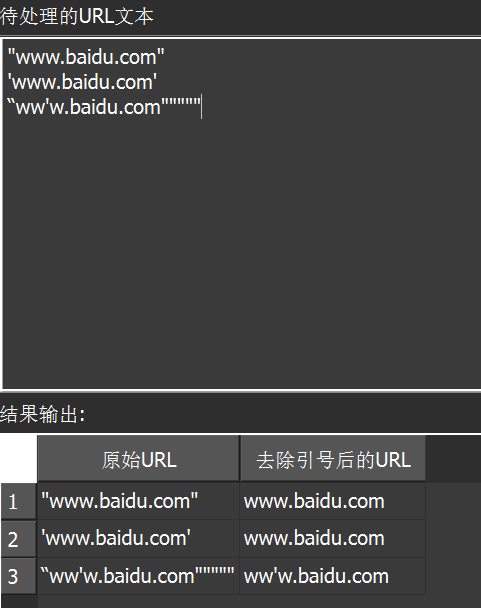


### 其他

##### 1. 控制输出是否去除空行

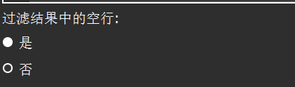

##### 2. 下载保存


##### 3. 如何复制一整列，点一下列标题，然后变成黄色后，在黄色处单机右键复制

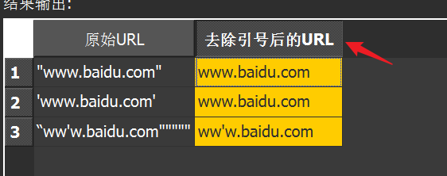

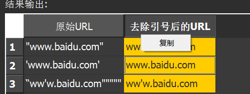

##### 5.主题颜色不好看？想换？

在这themes 下的 themes下添加自定义主题样式，默认提供了一个清新绿，一个像素（默认风格)

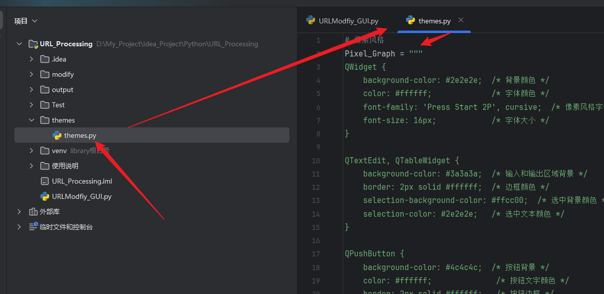

在URLmodfiy_GUI.py 中 导入


换成导入的主题

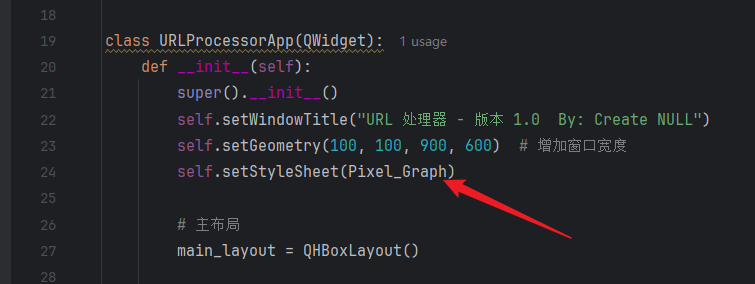

#### 6. 想要添加端口、添加协议时，更多的自动匹配？

修改 modfiy ->urlmodfiy.py -> map 的 self.map_protocol_to_port 和 self.map_port_to_protocol


##### 7. 去重

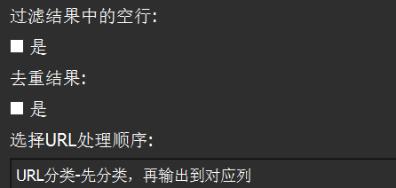 
